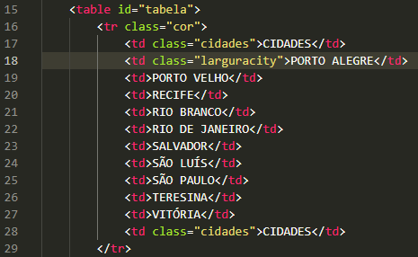
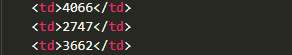

# Projeto - Tabela de distâncias entre capitais brasileiras

Projeto criado como parte da disciplina de Fundamentos de Desenvolvimento ministrada pelo professor Leonardo Rocha.

## Índice

* [Descrição](#descrição)
* [Tecnologias](#tecnologias)
* [Referências](#referencias)
* [Autor(a)](#autora)
### Descrição

O projeto consiste na composição de uma tabela que conta com capitais brasileiras e a distância entre essas capitais. As capitais constantes nesse projeto são:

* Porto Alegre
* Porto velho
* Recife
* Rio Branco
* Rio de Janeiro
* Salvador
* São Luís
* São Paulo
* Teresina
* Vitória

### Resultado do projeto.


#### Tabela

* table - Um conjunto de dados estruturados em linhas e colunas.
* tr - É usada para definir uma linha em uma tabela.

Veja uma imagem de parte do código, onde é possível identificar o uso dos elementos mencionados acima:




* td - Se trata de uma célula de dados numa tabela.


Veja mais uma imagem onde pode-se identificar este outro elemento citado acima:



### Estilização

O projeto foi estilizado, utilizando CSS3. Foi criado um arquivo chamado jujuba.css. Neste arquivo, constam configurações de estilo, apresentados a seguir:

* Estilo de cores- A corn de fundo utilizada no projeto foi definida com segue:

``` 
.rb{
    background-color: yellow;
}
```

## Tecnologias

* HTML
* CSS3
* README
* Git
* GitHub

## Referencias
[Alura](https://www.alura.com.br/artigos/escrever-bom-readme) - Como escrever um README íncrivel no seu GitHub.

## Autor(a)

Projeto desenvolvido pelo grupo:
* Maria Clara
* Ana Karoline
* Yasmin Faria
* Yasmin Camilly
* Geovanna Toledo