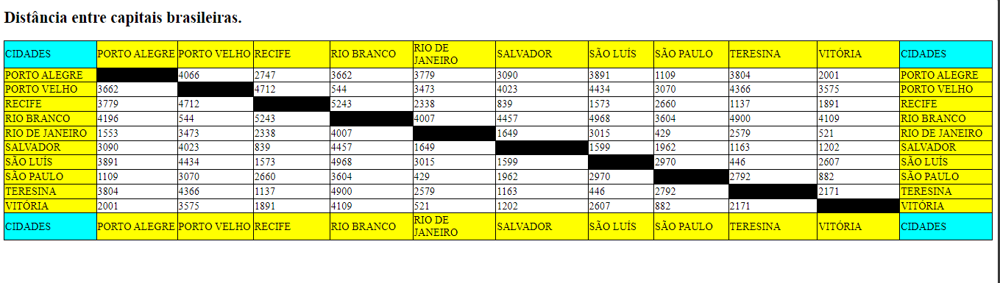

# Projeto - Tabela de distâncias entre capitais brasileiras

Projeto criado como parte da disciplina de Fundamentos de Desenvolvimento ministrada pelo professor Leonardo Rocha.

## Índice

* [Descrição](#descrição)
* [Tecnologias](#tecnologias)
* [Referências](#referencias)
* [Autor(a)](#autora)
### Descrição

O projeto consiste na composição de uma tabela que conta com capitais brasileiras e a distância entre essas capitais. As capitais constantes nesse projeto são:

* Porto Alegre
* Porto velho
* Recife
* Rio Branco
* Rio de Janeiro
* Salvador
* São Luís
* São Paulo
* Teresina
* Vitória

### Resultado do projeto.

## Tecnologias

* HTML
* CSS3
* README
* Git
* GitHub

## Referencias
[Alura](https://www.alura.com.br/artigos/escrever-bom-readme) - Como escrever um README íncrivel no seu GitHub.

## Autor(a)

Projeto desenvolvido pelo grupo:
* Maria Clara
* Ana Karoline
* Yasmin Faria
* Yasmin Camilly
* Geovanna Toledo